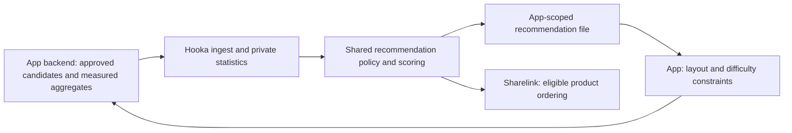

# RFC: Shared recommendation weights across consumer apps

Status: Design proposal; no runtime, provider call, scheduled job or placement policy is enabled.

Implementation progress: the [offline engine](../presets/recommendations.md)
implements slice 1 contracts/scoring/sampling. Ingestion, tasks, consumer adapters
and live integrations below remain proposed. Product-mode requests distinguish
candidates by subject + entity reference so one subject can rank several products.

## Decision

Hooka owns the reusable recommendation engine, scoring policies and eligible shared
learning. Consumer apps own measurement, their approved content and final layout.
Apps exchange versioned files with Hooka first. The initial implementation works
offline, before Toss Open API approval, using synthetic observations and adapters.

There are two recommendation targets:

1. **Subject selection**: which approved app subjects deserve exposure, with a
   returned sampling weight. Cattower can use this to choose words within a floor
   band while enforcing its difficulty and daily quotas.
2. **Product selection**: which eligible product to try for a subject. Sharelink
   uses the same engine through a provider adapter, after category/keyword checks.

Hooka also derives refresh priorities from consumer demand and expiry. Refresh
priority is a separate policy from exposure weight: a high score alone must not
monopolize provider budgets or starve newly eligible subjects.

## Existing implementation and compatibility constraints

- `pack-toss-sharelink/src/contracts.ts` defines strict v1 config and offer files.
  One subject currently has at most one ready offer in the consumer snapshot.
- `matching.ts` filters by reviewed category/keywords/exclusions and keeps the
  first three candidates; `service.ts` rechecks details before issuing a link.
  Manual mappings and pinned products retain their existing precedence.
- `operations.ts` accepts an expiring, app-scoped `workset` whose subject order
  determines refresh order. It does not calculate engagement scores.
- `reports.ts` collects app subTag financial reports. Their summary click count
  and product sales totals do not provide subject-level eligible impressions.
  They cannot be substituted for client measurement or assigned to a word.
- Sidecars coordinate provider access through a private SQLite store on one
  Docker host. There is no existing distributed learning service or app-scoped
  remote metrics API. Hooka's general admin token is unsuitable for app clients.

Keep `offers.json`, config v1, and workset v1 unchanged. Publish new recommendation
contracts in a separate namespace, starting at version 1. Do not add fields to old
strict snapshots. A default-off integration preserves existing candidate order
and scheduling. Old consumers can ignore the new files entirely.

## Components and ownership

| Component | Owner | Responsibility |
| --- | --- | --- |
| Measurement adapter | App backend | Resolve actual assignments, validate events, deduplicate, export complete aggregates |
| Recommendation pack | Hooka | Ingest aggregates, build statistics, score and sample approved candidates, explain decisions |
| Provider adapter | Hooka preset | Map provider products, apply hard eligibility, revalidate stock and issue app-specific links |
| Consumer adapter | App | Supply candidates/context, validate response, apply game/content/layout constraints |
| Sharing policy | Operator | Register apps/producers, comparable cohorts, canonical identities and policy versions |

Proposed package: `packages/pack-recommendations`, with pure contracts/scoring and
normal internal Hooka tasks. Keep Toss-specific code in `pack-toss-sharelink`.
The pack has no consumer DB connection, provider secret, network call or arbitrary
script execution requirement. Generic queue/runtime changes are deferred until
there is a concrete need for remote transport.

## Identity and evidence

- `appId` is the registered consumer boundary. `subjectId` belongs to that app;
  equal strings in different apps do not establish semantic identity.
- `canonicalSubjectId` is optional, operator-reviewed and versioned, such as a
  shared product intent. Do not infer equality from normalized word text. The
  registered mapping version determines which historical evidence is compatible;
  an intent change cannot silently relabel old observations.
- `entityRef` is an opaque Hooka-issued reference to a provider/product identity.
  Product identity includes provider and catalog scope. Equal numeric IDs across
  providers are unrelated. Manual links without a verified product mapping are
  app-local and cannot enter shared product statistics.
- `decisionId` identifies an immutable Hooka decision: app/config revision,
  policy version, input digest, candidate set, context and creation/expiry time.
- `assignmentId` is issued by the app backend when it applies a decision. Its
  backend stores date, subject/rule revision, chosen entity, actual placement,
  applied probability and any fallback. Hooka records the corresponding manifest.
  Never accept these relationships from a mobile/web client alone.
- `measurementProfileId` identifies versioned impression semantics. A Cattower
  profile can mean a fully visible word button for one continuous second while
  foreground and in an allowed game phase. Other apps may have another profile.
- `contextId` identifies app-local placement environment. Cattower has separate
  `floor-1-5`, `floor-6-20`, `floor-21-100` and ready/finished contexts. An operator
  can map compatible app contexts to a shared `cohortId`.

A refresh generation is not an exposure decision. Link renewal for the same
product does not manufacture a new impression. Product/rule changes create a new
assignment lineage; history remains attributed to the assignment actually shown.

## Sharing model

Reuse the engine across all apps. Share statistics only within an explicitly
registered learning group whose apps, measurement profiles, context mappings and
canonical identities are approved. Independent sidecars are not automatically
part of one learning group, even when they use the same provider account.

App-local results and shared results remain separate. A consumer receives only
its own candidates, weights and bounded confidence labels. Raw other-app counts,
financial reports, user identities, affiliate URLs and credentials are excluded.
Operators may inspect group aggregates in private reports. Do not issue another
app's link; Sharelink always resolves the requesting app's own subTag.

Default policy uses app-local evidence. Shared learning is opt-in and requires
compatible cohorts and a minimum number of contributing apps and exposures.
The first policy default requires at least one other contributing app and 200
eligible impressions across three distinct UTC days per entity/cohort. All gates
are evaluated after excluding the requesting app. With one other app, shared
prior strength is capped at five equivalent exposures. With two or more other
apps, use the regular cap of 20 and reject a pool where one app contributes over
80% of its counts. Insufficient or imbalanced evidence uses the cohort prior.
Two real apps can therefore start sharing with bounded influence and local
evidence remains dominant as it accumulates.
These are trial parameters to version and evaluate, not proven traffic targets.
Each contributing app must pass the measurement checks; reject the whole entity
pool rather than silently clipping counts and inventing a new population.

## Proposed file contracts

Names and limits below are proposed requirements, not published runtime schemas.
Use strict Zod schemas and generated JSON Schema when implementing them. Every
integer count/timestamp must be a nonnegative safe integer; all IDs are bounded.
Task payloads reference registered IDs/artifact IDs, never arbitrary URLs, paths,
SQL, secrets or formulas. Paths come from operator configuration.

### 1. Decision request and assignment manifest

`recommendation-request.v1` contains `requestId`, `appId`, `appRevision`,
`policyId`, `policyVersion`, `contextId`, `measurementProfileId`, `generatedAt`,
`expiresAt`, `seed` and up to 1,000 distinct candidates. Each candidate has a
`subjectId`, `ruleRevision` and optional registered `entityRef`. Request expiry
is at most 24 hours. Candidate attributes are allowlisted by the adapter; weights
and executable expressions from clients are rejected. Unknown or disabled
subjects/entities are rejected before scoring. File size limit: 2 MiB.

The app exports `assignment-manifest.v1` after applying a decision. It contains
the immutable assignment records described above, an app-local context, the
measurement profile and the evidence window. The app records whether it followed
the sampler, changed the selection under its constraints, or used its fallback.
Only records whose applied probabilities are reproducible under the stored
candidate set/policy may enter randomized comparisons. Missing probabilities do
not invalidate descriptive CTR, but exclude causal/holdout analysis.

### 2. Measurement aggregate snapshot

The app backend exports a **complete replacement** for one producer/app/UTC day,
with `schemaVersion`, `producerId`, `appId`, `periodStart`, `periodEnd`,
`revision`, `generatedAt`, `measurementProfileId` and `rows`.
The period is exactly one UTC day; current days are provisional and never used
for ranking. The backend seals a day after a 48-hour lateness allowance. The
rolling model uses the last 14 sealed days. Late corrections can replace a
retained day with a higher revision; gaps are unavailable data, never zero CTR.

Rows reference registered assignment IDs and include:

- unique eligible exposures (backend deduplicates by visit + assignment);
- unique exposed visits that clicked, each a subset of eligible exposures;
- unique clicked visits with a successful external dispatch, each a subset of clicks.

The observation unit is a visit + assignment opportunity, not a unique person or
an app-wide unique visit. Each opportunity has one context/profile/experiment
membership and is counted in one row per day. Backend deduplication spans event
retries and export reruns. Distinct assignments seen by the same visit are
distinct opportunities; reports must label this denominator explicitly. App
backends also retain the applied candidate set so constrained sampling can be
replayed without shipping user IDs to Hooka.

Require `dispatches <= clicks <= exposures`. Record clicks without qualifying
exposure separately for diagnostics; they do not enter the CTR numerator.
Retries count once. Successful dispatch is not a purchase. The app retains raw
events under its own policy; Hooka receives no visit/user/device ID or free text.
Aggregates can be internally consistent and still be inaccurate, so producer
validation, anomaly checks and shadow comparisons remain required.

Only one registered producer owns an app/day/profile. Start with an unsharded
complete snapshot, max 10,000 rows and 8 MiB. Conflicting producers, overlapping
periods, duplicate rows, inconsistent assignment lineage, unknown profiles or
unexpected future times reject the whole snapshot. Byte order is irrelevant:
canonicalize and hash the validated semantic payload.

In one immediate SQLite transaction, compare the composite snapshot key and
revision, then replace its normalized rows and update its digest. Same revision
and digest is a no-op; same revision with a different digest is a conflict;
lower revision is stale. Never increment totals on a retry. Recompute affected
daily statistics after replacement. Publication references one complete model
generation; partially ingested snapshots cannot leak into it.

Historical assignments may have older app/rule revisions: accept their sealed
evidence through the registered immutable manifest. Do not reject legitimate
history against today's config, and do not rank disabled current candidates.

### 3. Recommendation result

`recommendations.v1` is app-scoped and contains `requestId`, `decisionId`,
`appId`, `appRevision`, `policyId`, `policyVersion`, `modelGenerationId`,
`inputDigest`, `generatedAt`, `expiresAt`, `contextId`, `measurementProfileId`,
`seed` and candidate results with subject/rule identities.

Each result has `weight`, `rank`, `confidence` (`prior`, `local`, `shared`) and
bounded reason codes such as `cold-start`, `local-evidence`, `shared-prior`,
`insufficient-shared-evidence`. Weights are finite and nonnegative, sum to one
within the returned eligible set, and are meaningful only for that context/set.
They are not globally comparable conversion probabilities. A private decision
record retains counts, parameters and scores for reproducibility.

No eligible candidates produces an explicit empty result with reason
`no-eligible-candidates`. It does not create an unrelated recommendation. Expiry
is the minimum of request/policy validity and eligible offer validity when an
offer is required. A consumer that freezes daily words must hide an expired link
without reshuffling already-published words.

Publish immutable generation files, then atomically replace a small manifest in
the mounted directory. Validate all files before advancing the manifest. Keep
the previous complete generation for recovery. Consumers check request/input
digest, revisions, model/policy IDs, uniqueness, timestamps and weight invariants.
Expired/invalid/mismatched results use app-owned uniform constrained selection
or hide shopping; they never extend offer expiry or revive revoked mappings.

## Initial scoring policy

Choose an interpretable CTR policy first. Purchase/revenue objectives remain a
separate extension until there is reliable entity-level exposure attribution.
Do not distribute app subTag revenue across subjects or infer absent purchases.

For one canonical entity within one compatible cohort and one sealed window:

`N` denotes eligible assignment opportunities and `C` exposed opportunities with
at least one click. Local and other-app counts exclude holdouts and invalid
measurement periods. Both use the same versioned context/profile mappings.

1. Obtain a versioned Beta prior `(alpha0, beta0)`, initially `(1, 19)`.
2. If approved shared evidence passes all gates, calculate its posterior mean
   `mu = (alpha0 + C_other) / (alpha0 + beta0 + N_other)`, excluding the target app.
   Otherwise use `mu = alpha0 / (alpha0 + beta0)`.
3. Bound the shared prior strength `k`, initially 20 equivalent exposures (five
   when the shared pool has only one other app). With no accepted shared evidence
   use 20 for the fixed `(1,19)` prior. Local score is
   `(k * mu + C_local) / (k + N_local)`. Thus large apps do not overwrite
   local evidence with unlimited pooled samples.
4. For eligible candidates, normalize positive scores into exploitation mass.
   Final weight is `(1-epsilon) * score/sum(scores) + epsilon/m`, initially
   `epsilon=0.2`, with `m` eligible candidates. With no evidence, equal priors
   produce uniform weights. The degenerate zero-score case is explicitly uniform.
5. The pure sampler draws without replacement using a versioned deterministic
   PRNG and the stored seed. Renormalize remaining weights after each draw;
   record each conditional draw probability and candidate ordering.

An entity means a product for product ranking and an approved canonical subject
for subject ranking. Never sum overlapping assignment counts twice. Across apps,
counts describe deduplicated assignment opportunities, not distinct people
across the network. A subject without a canonical mapping learns locally under
its app/subject/rule lineage; it cannot enter a shared subject pool.
Pool counts only within a cohort; different floor bands and measurement profiles
remain separate. Priors/policy versions do not change existing daily decisions.

Category diversity, repeated destinations, difficulty, quotas and recent-use
rules are hard candidate/selection constraints supplied by an adapter. Generic
Hooka supports constrained candidate groups and records selection shortfalls;
Cattower owns what its bands and difficulty groups mean. No automatic relaxation
of these constraints. Applying extra app constraints after sampling requires
recording the changed candidate set/probability or marking the result observational.

Keep a uniform holdout cohort, initially 10% of app experiment units, assigned
persistently by the app. Store its experiment version in manifests and aggregate
rows; never mix holdout evidence into performance-directed training. Compare
game/use outcomes separately. This score estimates observed engagement within
a stratum; it is not a causal position-bias correction.

## Product and refresh integration

Sharelink first applies every existing hard rule, manual/pinned precedence and
stock/expiry validation. The scoring adapter orders eligible automatic candidates
before the existing three-attempt limit. It never increases catalog pages, detail
attempts, provider budgets or cache TTLs. No candidate collection just to train.
In phase 1, only already-observed eligible page candidates can be reordered; do
not claim a global best product across pages never fetched. New links remain
app-scoped, and refusals/errors keep their existing semantics.

A consumer demand file supplies an expiring set of intended subjects/context and
estimated reach, with an app/config revision. The offline refresh planner combines
this with offer expiry and bounded exploration to emit the existing workset v1.
The implementation must reserve capacity for unobserved/stale eligible subjects
and respect operator per-app shares of shared-account budgets. Document maximum
refresh wait and overflow behavior; never pretend ordering alone enforces account
fairness. Phase 1 only emits a preview; live queue dispatch waits for an explicit
fairness implementation. Recommendations do not implicitly activate a scheduler.

## Persistence and deployment

Use a new private `HOOKA_RECOMMENDATIONS_DB_PATH`, separate from the queue,
Sharelink credential/budget store and consumer databases. It is owned by one
learning-group aggregator on one host. Initialize through a versioned additive
migration; status/dry-run open read-only and do not initialize it.

Proposed tables: producers/apps/cohort mappings; canonical entities; immutable
decision and assignment manifests; aggregate snapshot ledger and normalized rows;
derived daily statistics; policy versions; model generations and audit events.
Uniqueness keys encode app, producer, UTC day, profile and revision. Decisions
reference immutable policy/model generations. The completed generation pointer
changes only after derivation and export succeed.

Retain accepted aggregate days for 90 days, decision/assignment manifests and
idempotency tombstones for 120 days; reject corrections to pruned days. Any longer
analysis needs an explicit retention policy. Purges retain the minimum replay
keys, never silently permit an old batch to be counted again. Account/app removal
revokes membership and rebuilds affected shared generations; historic private
audit records follow the configured retention policy.

Local transport uses operator-registered app-specific inboxes and read-only
app-specific outboxes, with atomic renames and producer ownership. Apps cannot
write the learning DB or read another app's files. A single importer validates
size, schema and app-bound ownership before any task enqueue. Queue payloads
contain artifact IDs/digests, not complete high-volume rows.

Remote sidecars exchange artifacts through a future authenticated ingress and
distribution adapter; do not mount SQLite over network storage or assume local
volumes span hosts. Each producer credential is bound to its app and operation,
with request size/rate limits, signed digest/timestamp and replay protection.
No browser/mobile gets a Hooka admin token. Cross-host sharing requires a central
aggregator and this scoped transport; until then sidecars learn only locally.

## Proposed operations

Initial offline operations (names reserved by this proposal):

- `recommendations validate`: validate registered config and artifact contracts.
- `recommendations ingest`: ingest a registered aggregate/manifest artifact.
- `recommendations build`: derive one immutable sealed model generation.
- `recommendations plan`: pure score/sample preview for a registered request.
- `recommendations export`: publish app-specific decisions atomically.
- `recommendations status`: read-only counts, freshness, missing sealed periods,
  conflicts, shared-gate reasons and last completed model generation.

Internal tasks reuse existing retry/dead-letter facilities. Validation/conflicting
revisions are terminal; busy/temporary I/O errors are retryable. Failure to learn
leaves current valid offers usable and falls back to baseline selection. It does
not withdraw offers, consume provider budgets or change game progression.

## Implementation slices and acceptance criteria

| Slice | Deliverable | Acceptance before enabling |
| --- | --- | --- |
| 1 | Pure recommendation pack, v1 contracts, policy validator, scorer/sampler and synthetic fixtures | Two apps, isolated defaults, compatible opt-in sharing, deterministic replay, finite normalized weights, sparse/zero evidence, holdout separation |
| 2 | Private store, manifests, aggregate ingestion, sealed model generations and local CLI | Retry no-op, conflicting/stale batches, whole-day replacement, historical revisions, late corrections, pruning/replay, crash recovery and read-only status |
| 3 | Cattower measurement/export adapter and shadow daily preview | Actual visit/assignment dedupe, viewport/phase validation, 1/4/10 band quotas, difficulty preservation, ordinary-word fallback and no published-day reshuffle |
| 4 | Sharelink ordering adapter and refresh-priority preview | Old defaults identical, manual/pinned/exclusions preserved, bounded page/attempt/budget use, expired model fallback |
| 5 | Scoped cross-host transport and shared aggregator deployment | App-bound credentials, replay/size/rate tests, producer isolation, atomic distribution and revoke/rebuild |
| 6 | Opt-in live pilot and budget-fair refresh dispatch | Verified provider approval when used, valid links, holdout metrics, app outcome guardrails, operator preview and rollback |

Slices 1–3 can proceed before Open API approval using synthetic offers. A second
real consumer is required to validate shared cohort semantics; a fixture proves
mechanics only. Slice 4 can be implemented with a fake provider, with live use
gated on approval. Start app-local and shadow mode, then approve sharing groups,
then enable placement/ranking independently per app. Disable the recommendation
policy to restore the old Sharelink ordering and app uniform constrained fallback;
preserve existing offers, revisions, daily words and measurement history.

## Release plan

This RFC is documentation only and needs no version change. Backward-compatible
preset-specific tasks/adapters/contracts use an `npm/hooka: patch` changeset under
the repository release policy. If scoped remote ingress adds general server/runtime
functionality, that slice uses `minor`. Breaking existing published behavior or
contracts requires `major`; separate new v1 files do not mutate Sharelink v1.

## Decisions deferred to a later RFC revision

- A second real app's measurement/cohort mappings and the first learning group.
- Purchase/revenue attribution, additional providers and objective blending.
- Remote transport implementation and operational ownership across Docker hosts.
- Evidence-based tuning of sample gates, priors, exploration and holdout fractions.

These do not block the pure engine or offline ingestion. Keep defaults explicit,
versioned and observable; avoid presenting provisional values as learned optima.
